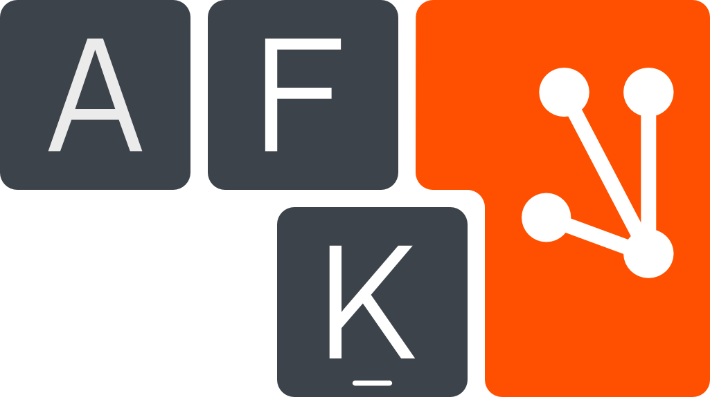
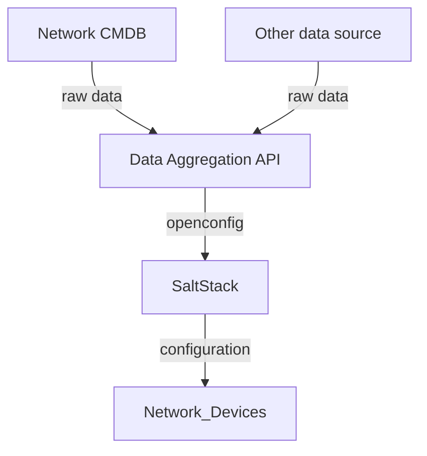

{ width="200" align=right loading=lazy }

# Overview

## What is it?

At Criteo, we have decided to fully open source our network automation framework.

It is based on [NetBox](https://netbox.dev), [OpenConfig](https://www.openconfig.net/), [SaltStack](https://github.com/SaltStack/salt), and supports Juniper JunOS, Arista EOS and [SONiC](https://sonic-net.github.io/SONiC/).

!!! note

    If you are using an ad-blocker, this documentation might not work properly as "Criteo" is in some links.

## Repositories

| Repository | Description | Latest commit |
|------------|-------------|---------------|
| [Network CMDB](https://github.com/criteo/netbox-network-cmdb)             | Network CMDB plugin for Netbox                            |  |
| Data aggregation API (coming soon)                                        | Aggregate data from CMDB and convert to OpenConfig        | |
| [OpenConfig Salt modules](https://github.com/criteo/openconfig-SaltStack) | Salt modules to apply configuration from OpenConfig data  |  |
| [SONiC Salt Deployer](https://github.com/criteo/sonic-salt-deployer)      | Tool to deploy and configure salt-minion on SONiC devices |  |
| [SONiC SaltStack](https://github.com/criteo/sonic-SaltStack)              | States/execution modules for SONiC                        |  |
| [SONiC utilities](https://github.com/criteo/criteo-sonic-utilities)       | SONiC scripts used by some SONiC SaltStack modules        |  |

## Global design

!!! note

    Our approach to automation is opinionated. There are tons of ways of doing network configuration, and choices must be made.

This diagram shows the components of our framework:

### Network CMDB

The Network CMDB contains data relative to the business and is completely agnostic to the network OS.

The models are designed to describe the objects themselves rather than the configuration from device perspective. The idea is also to avoid any data duplication which could lead to configuration mismatches.

For instance, we represent the BGP session itself with two joined tables describing peers:
`DeviceBGPSession` <==> `BGPSession` <==> `DeviceBGPSession`

* `DeviceBGPSession` contains the `local-as` but not the `peer-as`, avoiding data duplication. The `peer-as` being the `local-as` of the other neighbor.
* `BGPSession` contains all information peers have in common, like status (`in production`, `maintenance` etc...) or `MD5 password`.

### Data Aggregation API

This API aggregates data from their sources of truth: the Network CMDB or possibly any other data source you may have.

Then, it computes this data to provide OpenConfig JSON for each device as an output.

[ygot](https://github.com/openconfig/ygot) is used to validate the output against the OpenConfig YANG models.

### SaltStack OpenConfig

Salt takes OpenConfig data and converts it as Network configuration. We are using templates to do that.

The end goal is to simply forward this OpenConfig data to the Network OS to apply the configuration. Currently, OpenConfig is, at best, partially implemented in Network Operating Systems.
